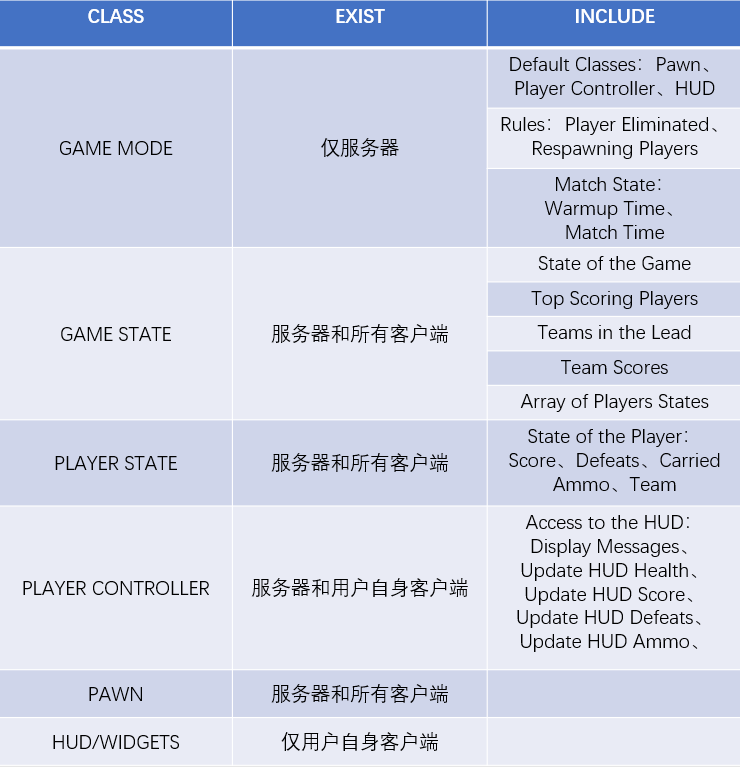

# JJJJinx
Multiplayer Online TPS Battle - UE4 Game Development

**Progress**

version1.1--2022.10.13

## 开场白

游戏开发纯纯的个人兴趣，正在朝这个方向不断努力，也希望以后能从事这个行业...

之前暑假也有参加腾讯举办的游戏客户端公开课，还是有所收获的，布置的作业也有在做，但是是用纯蓝图写的，个人不是太满意（模型、效果以及bug过多）。所以在课程结束后，尝试用c++重新写一个项目，继自身的学习以及从网上找的一些资源得到了目前的这个项目，个人感觉还可以？嘻嘻。

为什么游戏名叫 **JJJJinx**，懂得都懂~~

**声明**：游戏开发的编辑器为UE4.27，由于UE是向下兼容的，所以低版本的可能打不开这个...**Config**中为配置文件。**Content**中为**资产、蓝图和地图**文件夹，其中资产文件夹中又包括：LearningKit_Games为UE4免费的新手入门包，它包含了最基本的人物骨骼、许多静态网格体以及地图等（我是看上了它可爱的画风所以用的，且它和UE4小白人的骨骼几乎没有区别，重定向很方便）；MilitaryWeapSilver也是UE4免费的武器入门包，包含各种武器的骨骼和物理资产以及子弹等附加资产，非常不错子；还有一些乱七八糟的声音、十字准星贴图、字体等。**Plugins**是自己编写的实现多人游戏插件。最后的**Source**文件夹则是源代码，下面也会着重介绍。

## 游戏整体架构

游戏是基于服务器-客户端托管于UE4在线子系统Steam开发的，目前是可以通过登录Steam在同一个LAN下进行游戏。可能后续还会实现在不同的局域网也可以联机的功能。

## Source中已实现的源文件和对应功能函数

### Character

Character是咱们游戏的主角，所有与主角有关的状态、UI等都需要在此实现。

#### BlasterCharacter

BlasterCharacter是实现人物基础功能的文件

##### 构造函数ABlasterCharacter()

设置了相机及弹簧臂组件与人物之间的关系，使得它是一个TPS；设置了人物碰撞；设置了人物移动与摄像机关系；设置了任务转身等。

##### Tick()

系统自带每帧都刷新的函数，其中使用了瞄准偏移函数AimOffset()，实现服务器更新人物移动的函数OnRep_ReplicatedMovement()以及实时更新俯仰角使得在服务器看来客户端的人物不至于抽搐的函数CalculateAO_Pitch()以及人物靠近任何静态网格体都隐藏人物网格体的函数HideCameraIfCharacterClos()。

##### BeginPlay()

系统自带的游戏开始时自动执行的函数，其中使用了更新人物血量的函数UpdateHUDHealth()，以及实现伤害事件的系统自带函数OnTakeAnyDamage()。

##### 人物移动MoveForward()、MoveRight()、Jump()

##### 人物转身及俯仰Turn()、LookUp()

##### 模拟代理转身SimProxiesTurn()、人物转身TurnInPlace()

通过计算俯仰角函数CalculateAO_Pitch()更新人物状态

##### 输入绑定案件SetupPlayerInputComponent()

一些游戏输入按键的绑定。

##### 腰射开火按键按下与松开FireButtonPressed()、FireButtonReleased()

##### PlayFireMontage()、PlayElimMontage()、PlayHitReactMontage()

播放开火蒙太奇动画、播放人物消失蒙太奇动画、播放人物受伤蒙太奇动画

##### 机瞄按键按下与松开AimButtonPressed()、AimButtonReleased()

##### 蹲下按键按下CrouchButtonPressed()与装备武器按键按下EquipButtonPressed()

##### 计算人物速度CalculateSpeed()

##### 人物受伤ReceiveDamage()

实现人物血量UI的更新，并播放受伤动画蒙太奇，如果人物血量为0，调用GameMode中的人物死亡函数PlayerEliminated()。

##### 人物消失Elim()

人物被击杀后，通过人物消失广播函数MulticastElim()将消息传送给其他客户端和服务器，再通过系统自带计时器函数GetWorldTimerManager().SetTimer()设置人物死亡时间。

##### 人物消失广播MulticastElim()

播放人物消失蒙太奇动画。

##### 人物消失计时器结束ElimTimerFinished()

人物死亡消失后经过一段时间，调用RequestRespawn()使得人物重生。

#### BlasterAnimInstance

##### 更新人物动画实例NativeUpdateAnimation()

通过调用BlasterCharacter中的函数定义一些有关人物的变量，例如是否在空气中，是否加速、是否装备武器、是否死亡等，并将结果映射到蓝图中的按Bool混合姿势的自变量中，实现人物对应状态动画的播放。

同时解决了人物在扫射过程中偏航角Yaw值不对的bug

以及由于人物骨骼与武器不适配，即人物骨骼并没有在应有的武器位置上而实现的左手IK功能。

### Weapon

#### Weapon基类：实现枪械最基本的功能。

##### 构造函数AWeapon()

设置所有通道的冲突响应，设置武器可拾取的圆形检测区域以及人物进入该区域后的拾取UI。

##### 人物与武器可拾取的圆形检测区域重叠与不重叠事件OnSphereOverlap()、OnSphereEndOverlap()

重叠时Pick-Up用户控件可见，不重叠时不可见。

##### 设置武器状态SetWeaponState()

设置武器状态为未捡、已捡，已捡则不再显示Pick-Up用户控件。

##### 展示可捡控件ShowPickupWidget()

##### 开火事件Fire()

#### ProjectileWeapon

父类为Weapon

##### 重写开火事件Fire()

#### Projectile基类：用于实现不同类型的弹药

##### 构造函数AProjectile()

有关Projectile的碰撞设置。

##### BeginPlay()

实现发射体的踪迹记录。

##### 击中OnHit()

摧毁发射体。

##### 销毁Destroyed()

#### ProjectileBullet

父类为Projectile

##### 重写击中OnHit()

真实的子弹，应用伤害。

#### Casing

作为枪发射后产生的子弹外壳。

##### 构造函数ACasing()

设置物理、重力、碰撞等。

##### BeginPlay()

给其静态网格体施加一个力，让它能飞出去。

##### 着地OnHit()

播放音效后销毁。

### HUD

#### OverheadWidget

主要是用来说明服务器和客户端的网络角色关系，不用于最后的游戏实例。

#### BlasterHUD

##### DrawHUD()

将十字准星贴图绘在屏幕上。

##### DrawCrosshair()

设置十字准星大小。

### BlasterComponents

#### CombatComponent

##### 构造函数UCombatComponent()

设置人物基础移速和瞄准状态移速（当然也可以蓝图中直接修改）。

##### BeginPlay()

设置人物速度和跟随摄像机。

##### TickComponent()

实时更新发射体的路径、击中目标物、十字准星、以及瞄准状态的视野领域。

##### 开火按键按下FireButtonPressed()

##### 开火事件Fire()

##### 用于实现自动开火的StartFireTimer()、FireTimerFinished()

鼠标左键一直按着就是自动开火。

##### 用于服务器和客户端开火广播的通知ServerFire()、MulticastFire()

##### EquipWeapon()

武器装备，将武器静态网格体绑定在人物手骨骼上。

##### 瞄准到敌人TraceUnderCrossairs()

通过通道检测线条，检测到敌人时，十字准星变红，其他状态为白。

##### 战斗状态下十字准星的设置SetHUDCrosshairs()

实现准星因为人物状态（跑动、蹲下、跳跃、瞄准）改变而扩张或缩小。

##### 机瞄改变视野InterpFOV()

机瞄状态下看得更远更清晰，但视野范围变小。

##### SetAiming()

机瞄状态下人物速度改变。

### GameMode

游戏地图首先是GameStartupMap，为一个开始界面：创建游戏、加入游戏和退出游戏。当点击创建游戏时，进入地图Lobby；点击加入游戏时则自动搜寻与自己处于一个局域网下的已开始游戏并加入；退出游戏当然就是退出游戏。

#### LobbyGameMode

##### PostLogin()

当进入地图Lobby的玩家大于等于2（目前设置，便于测试）时，自动进入游戏地图BlasterMap。

#### BlasterGameMode

##### 玩家消失PlayerEliminated()

调用Elim()

##### 玩家重生RequestRespawn()

玩家死亡后等待消失计时器结束重新复活，复活位置随机

## 最后

新添加的功能都会在对应模块写出，更新时间及内容也会在README文件的开头Progress指出。

此项目纯属个人娱乐，记录自己的开发过程，激励自己不断学习 :)

